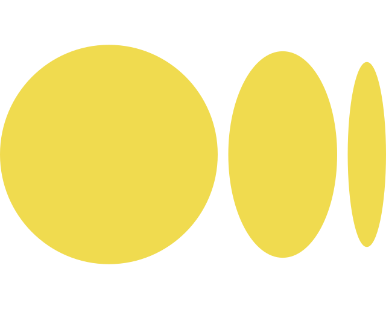

<h3> Welcome to my Github Profile 👋 </h3>
<h5>Hello, this is <b>Cihat Salik</b></h5>

   I am an inquisitive software engineer and a recent graduate in Computer Science. I have a passion for open-source development and take pleasure in creating projects inspired by existing ones while exploring emerging technologies.

   
<b>More...</b>

    
   

      
      
   

   
   <a href ="https://www.codewars.com/users/cihatdev"> 
   <a/>

  
  
    
  
    
    
    
    

